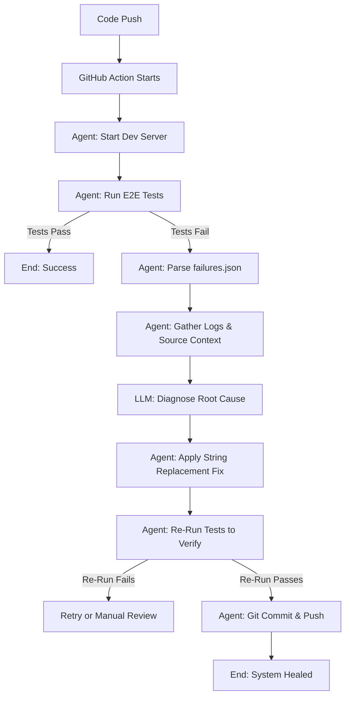

# Autonomous QA & Code-Fixing Agent Architecture

This document provides a technical overview of the system's architecture and the execution lifecycle of the Autonomous AI Fixer Agent.

## System Overview

The system is designed to create a "Self-Healing" CI/CD pipeline. It bridges the gap between test failure detection and issue resolution by using high-performance LLMs (Groq/Llama or Gemini) to diagnose and fix bugs in both test code and application source code.

---

## 1. Core Components

### A. Orchestration Layer (`agent/fixer_agent.py`)
The "brain" of the operation. It is a Python-based engine that manages the entire lifecycle of a test run.
- **Server Management**: Handles background startup/shutdown of the Vite development server with native port-probing for readiness.
- **Process Control**: Executes shell commands and monitors exit codes.
- **Context Gatherer**: Aggregates test reports, server logs, agent logs, and relevant source code into a structured prompt for the AI.

### B. Intelligence Layer (Groq / Gemini)
The reasoning engine.
- **Provider**: Currently optimized for **Groq** (`llama-3.3-70b-versatile`) for speed and reliability.
- **Context Injection**: Uses a sophisticated prompt that includes:
    - **Trimmed JSON Report**: Only failed steps to save tokens.
    - **Log Snippets**: Last 2000 chars of server and agent execution logs.
    - **Source Code**: Critical project files (constants, page objects, components).
- **Output**: Generates a precise JSON instruction set containing the `target_file`, `old_code`, and `new_code`.

### C. Test Suite (Playwright + Cucumber)
The validation layer.
- **Functional Testing**: Behavioral scenarios written in Gherkin (`.feature`).
- **Visual Testing**: Automated snapshot comparison using `pixelmatch` to catch layout/CSS regressions.
- **Artifacts**: Generates comprehensive HTML and JSON reports after every execution.

### D. CI/CD Integration (GitHub Actions)
The trigger layer.
- **Workflow**: `.github/workflows/ai-fixer.yml` runs on every push.
- **Persistence**: Automatically uploads all reports and logs as GitHub artifacts.
- **Write Authority**: Uses repository secrets and explicit write permissions to allow the agent to commit and push fixes back to `main`.

---

## 2. Agent Execution Flow

### Detailed Steps:
1.  **Readiness Check**: The agent uses a Python socket loop to ensure the application is responsive at `127.0.0.1:5173` before starting Playwright.
2.  **Failure Analysis**: If `npm run test:e2e` fails, the agent scans the Cucumber JSON report. It identifies exactly which step failed and where it is located in the code.
3.  **Multi-Failure Pattern Recognition**: The agent sends up to 5 failures simultaneously to the AI. This helps the AI distinguish between a one-off flake and a systemic issue (like a broken shared selector).
4.  **Self-Correction**: The agent applies the AI's suggested fix using a precise string replacement. It ensures only one change is made at a time to maintain system stability.
5.  **Verification**: The agent re-runs the full test suite. It will **never** push code that doesn't result in a 100% passing test suite.

---

## 3. Failure Categories Handled

| Category | Diagnosis Logic | Fix Action |
| :--- | :--- | :--- |
| **Selectors** | AI compares `constants.ts` with component JSX. | Updates CSS selector in constants file. |
| **Flaky Timing** | Detects "masked timeouts" in specific steps. | Replaces brittle waits with robust Playwright state checks. |
| **App Logic** | Identifies mismatches in filtering or data handling. | Corrects JavaScript/React logic in `src/`. |
| **Visual Regressions** | Detects pixel mismatches in snapshots. | Corrects CSS or updates baseline if change was intentional. |
| **API/Contract** | Sees 404s or 500s in server logs. | Adjusts frontend fetch logic or mock data. |

---

## 4. Key Performance Optimizations

- **Token Trimming**: Aggressively strips metadata from JSON reports and truncates long source files to 3000 chars.
- **Rate-Limit Management**: Implements exponential backoff and retries for LLM API calls.
- **Native Process Cleanup**: Uses process groups (`os.setsid`) to ensure no "zombie" dev servers are left running in the CI environment.
